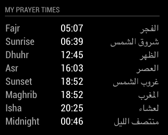

# MMM-MyPrayerTimes
MyPrayerTimes is a simple Module, that calculates the prayer times for any location around the world, based on a variety of calculation methods currently used in Muslim communities using the Aladhan API. 

The mathematical side of how the calculation should work is generally agreed upon in the Islamic world. Then again, this is an assumption I am making based on the number of countries that use the angle based calculation (and please note that I am not religiously or formally qualified and am providing this information with absolute humility in the hope that it may be useful). However, based on location, government preferences, and other 'factors', there are differences in the methods that produce, sometimes, a substantial variation in timings. If the mathematical side interests you, have a look at this excellent explanation: http://praytimes.org/wiki/Prayer_Times_Calculation.

A calculation method is typically made up of the following:

- The Fajr Angle
- The Maghrib Angle or minutes after sunset that Maghrib should be
- The Isha Angle or minutes after Maghrib that Isha should be

The AlAdhan API has default values for all 3, and most methods only specifically specify Fajr and Isha.

Most countries adhere to one of the above methods, and they then tune the timings further, by adding a few minutes here and there, based on criteria that may seem completely arbitrary. 



## Installation
Clone this repository in your modules folder, and install dependencies:

```
cd ~/MagicMirror/modules 
git clone https://github.com/htilburgs/MMM-MyPrayerTimes
cd MMM-MyPrayerTimes
npm install 
```

## Configuration
Go to the MagicMirror/config directory and edit the config.js file.
Add the module to your modules array in your config.js.

```
{
  module: 'MMM-MyPrayerTimes',
  position: 'top_left',
  header: 'My Prayer Times',
  config: {
          mptLat: null,			// Replace with the latitude of your location
	  mptLon: null,			// Replace with the Longitude of your location
	  mptMethode: 3,		// Which calculation methode is used, see options below
	  showSunrise: true,		// Display Sunrise, false if you want to hide
	  showSunset: true,		// Display Sunset, false if you want to hide
	  showMidnight: true,		// Display Midnight, false if you want to hide
	  showImsak: true,		// Display Imsak, false if you want to hide
	  show24Clock: true,		// Default display 24hour clock -> false is 12hour (AM/PM) clock
	  }
},
```
To get your latitude and longitude, you can go to https://latitudelongitude.org

## Module configuration
Here is the documentation of options for the modules configuration:

<table>
  <thead>
    <tr>
      <th>Option</th>
      <th>Description</th>
    </tr>
  </thead>
  <tbody>
    <tr>
      <td><code>mptLat</code></td>
      <td>The latitude of your location for a correct calculation<br /><br /><strong>Number</strong><br />Default: <code>null</code></td>
    </tr>
    <tr>
      <td><code>mptLon</code></td>
      <td>The longitude of your location for a correct calculation<br /><br /><strong>Number</strong><br />Default: <code>null</code></td>
    </tr>
    <tr>
      <td><code>mptMethod</code></td>
      <td>Kind of calculation method to use<br /><br /><strong>Default: </strong>Number<br /></strong>Possible values:
	  <li>0 - Shia Ithna-Ansari</li>
	  <li>1 - University of Islamic Sciences, Karachi</li>
	  <li>2 - Islamic Society of North America</li>
	  <li>3 - Muslim World League</li>
	  <li>4 - Umm Al-Qura University, Makkah</li>
	  <li>5 - Egyptian General Authority of Survey</li>
	  <li>7 - Institute of Geophysics, University of Tehran</li>
	  <li>8 - Gulf Region</li>
	  <li>9 - Kuwait</li>
	  <li>10 - Qatar</li>
	  <li>11 - Majlis Ugama Islam Singapura, Singapore</li>
	  <li>12 - Union Organization islamic de France</li>
	  <li>13 - Diyanet İşleri Başkanlığı, Turkey</li>
	  <li>99 - Custom. See https://aladhan.com/calculation-methods</li>
	</strong></td>
	</tr>
    <tr>
      <td><code>showSunrise</code></td>
      <td>Shows Sunrise in the Prayer Times<br /><br /><strong>True / False</strong><br />Default: <code>true</code></td>
    </tr>
     <tr>
      <td><code>showSunset</code></td>
      <td>Shows Sunset in the Prayer Times<br /><br /><strong>True / False</strong><br />Default: <code>true</code></td>
    </tr>
    <tr>
      <td><code>showMidnight</code></td>
      <td>Shows Midnight in the Prayer Times<br /><br /><strong>True / False</strong><br />Default: <code>true</code></td>
    </tr>
    <tr>
      <td><code>showImsak</code></td>
      <td>Shows Imsak in the Prayer Times<br /><br /><strong>True / False</strong><br />Default: <code>true</code></td>
    </tr>
    <tr>
      <td><code>show24Clock</code></td>
      <td>Show Prayer Times in 12hour (AM/PM) or 24hour format<br /><br /><strong>True / False</strong><br />Default: <code>true</code></td>
    </tr>
</tbody>
</table>

## Language support
The MMM-MyPrayerTimes module support different languages. 

## License
### The MIT License (MIT)

Copyright © 2019 Harm Tilburgs

Permission is hereby granted, free of charge, to any person obtaining a copy of this software and associated documentation files (the “Software”), to deal in the Software without restriction, including without limitation the rights to use, copy, modify, merge, publish, distribute, sublicense, and/or sell copies of the Software, and to permit persons to whom the Software is furnished to do so, subject to the following conditions:

The above copyright notice and this permission notice shall be included in all copies or substantial portions of the Software.

The software is provided “as is”, without warranty of any kind, express or implied, including but not limited to the warranties of merchantability, fitness for a particular purpose and noninfringement. In no event shall the authors or copyright holders be liable for any claim, damages or other liability, whether in an action of contract, tort or otherwise, arising from, out of or in connection with the software or the use or other dealings in the software.
